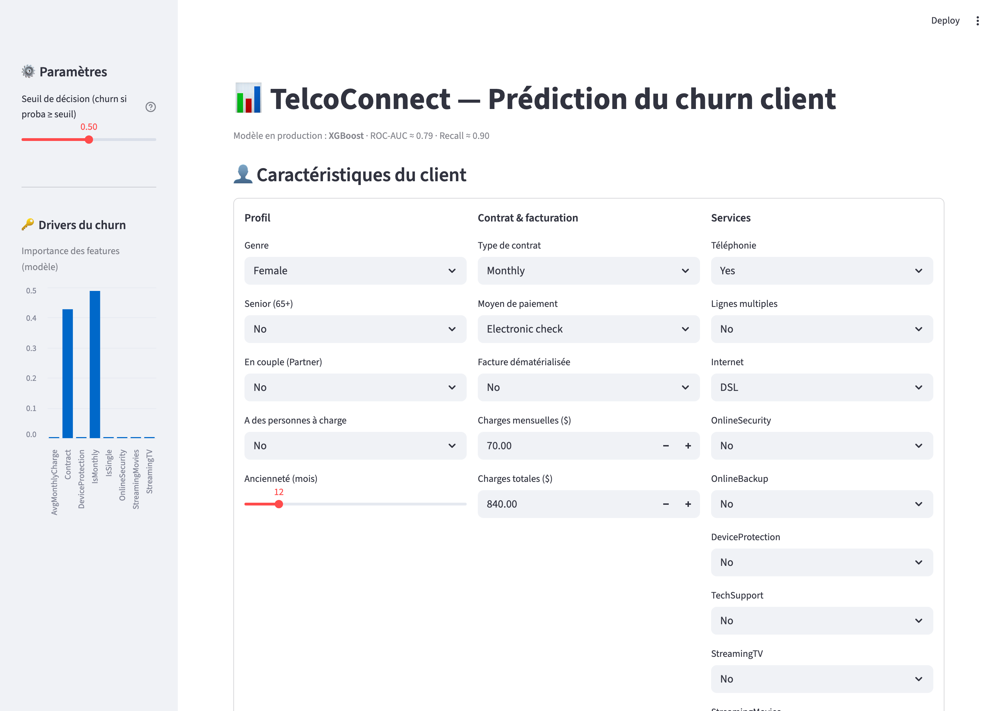
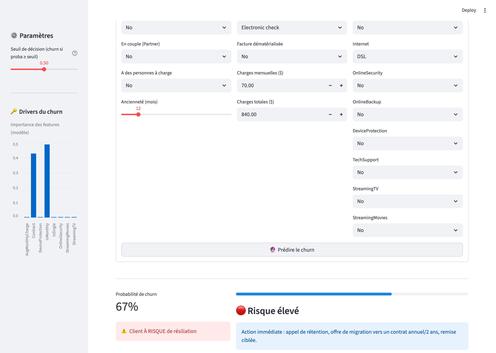

# Prédiction du Churn Clients — TelcoConnect 📊

Projet Data Science **de bout en bout** : prédire quels clients risquent de
résilier leur abonnement chez TelcoConnect et comprendre les raisons des départs,
puis exposer le modèle via une application Streamlit.

---

## 🎯 Objectifs

- Identifier les facteurs clés expliquant le churn
- Construire un modèle pour anticiper les clients à risque
- Aider les équipes Marketing & Customer Success à cibler leurs actions
- Fournir une application simple pour scorer un client

---

## 📈 Résultats clés

| Métrique (test, 16 609 clients) | Valeur |
|---------------------------------|--------|
| Modèle retenu | **XGBoost** |
| ROC-AUC | **0.79** |
| Recall (churners détectés) | **0.90** |
| F1-score | **0.78** |

**Facteur n°1 du churn : le contrat mensuel** — `IsMonthly` + `Contract`
concentrent **~92 %** du pouvoir prédictif. Un client mensuel a ~67 % de risque
de churn ; en contrat 2 ans, ~6 %.

➡️ Détails et plan d'action : [`reports/business_recommendations.md`](reports/business_recommendations.md)

---

## 🖥️ Démonstration de l'application

L'application Streamlit permet de saisir le profil d'un client et d'obtenir
instantanément sa probabilité de churn, le niveau de risque et l'action recommandée.

**Écran d'accueil — saisie des caractéristiques du client :**



**Résultat après une prédiction (client au contrat mensuel → risque élevé) :**



---

## 🗂️ Structure du projet

```
telcoconnect-churn/
├── data/                 # Données brutes, nettoyées, préprocessées (X/y train/test)
├── notebooks/            # 01 audit → 06 entraînement des modèles
├── src/
│   ├── train_models.py   # Entraînement, évaluation, sauvegarde des modèles
│   └── inference.py      # Feature engineering + prédiction (production)
├── app/
│   └── app.py            # Application Streamlit de scoring
├── models/               # preprocessor.pkl, best_model.pkl
├── reports/              # Figures, comparatif modèles, recommandations business
├── requirements.txt
└── README.md
```

---

## 🔄 Pipeline du projet

| Étape | Notebook / Script | Statut |
|-------|-------------------|--------|
| 1. Audit des données | `notebooks/01_data_audit.ipynb` | ✅ |
| 2. Nettoyage | `notebooks/02_data_cleaning.ipynb` | ✅ |
| 3. Feature engineering | `notebooks/03_data_feature_engineering.ipynb` | ✅ |
| 4. Analyse exploratoire (EDA) + tests stats | `notebooks/04_exploratory_data_analysis.ipynb` | ✅ |
| 5. Préprocessing (scaling/encoding, split) | `notebooks/05_data_formating_for_ML_training.ipynb` | ✅ |
| 6. Entraînement & évaluation des modèles | `notebooks/06_Churn_prediction_ML_Model_Training.ipynb` | ✅ |
| 7. Application Streamlit | `app/app.py` | ✅ |
| 8. Recommandations business | `reports/business_recommendations.md` | ✅ |

---

## 🚀 Comment lancer

### 1. Installation

```bash
python3 -m venv venv
source venv/bin/activate
pip install -r requirements.txt
```

### 2. (Ré)entraîner les modèles

```bash
python src/train_models.py
```
Produit : `models/best_model.pkl`, `reports/model_comparison.csv`,
`reports/metrics.json` et les figures dans `reports/figures/`.

### 3. Lancer l'application de scoring

```bash
streamlit run app/app.py
```
Saisir les caractéristiques d'un client → probabilité de churn + recommandation.
Le seuil de décision est ajustable dans la barre latérale.

### 4. (Optionnel) Explorer le notebook d'entraînement

```bash
jupyter notebook notebooks/06_Churn_prediction_ML_Model_Training.ipynb
```

---

## 🧠 Comment fonctionne l'entraînement (expliqué simplement)

Tout le détail commenté est dans
[`notebooks/06_Churn_prediction_ML_Model_Training.ipynb`](notebooks/06_Churn_prediction_ML_Model_Training.ipynb).
En quelques mots, pour quelqu'un qui découvre le Machine Learning :

1. **Apprendre puis tester sur des données différentes.** On montre au modèle
   75 % des clients (dont on connaît déjà le résultat) pour qu'il apprenne, et on
   garde 25 % de côté — jamais vus — pour vérifier honnêtement s'il généralise.
2. **Comparer plusieurs modèles, pas un seul.** On met en concurrence **5 modèles**
   (Régression Logistique, Arbre de décision, Random Forest, HistGradientBoosting,
   XGBoost) du plus simple au plus sophistiqué.
3. **Juger de façon fiable (validation croisée).** Plutôt qu'un seul test (parfois
   chanceux), on répète l'évaluation **5 fois** sur des découpages différents et on
   regarde la moyenne. C'est la *cross-validation*.
4. **Choisir les bonnes métriques.** Comme rater un futur partant coûte cher, on
   privilégie le **Recall** (part des churners détectés) et le **ROC-AUC** (capacité
   à bien classer), pas seulement le taux de bonnes réponses.
5. **Régler finement (hyperparamètres).** On teste plusieurs **configurations** des
   meilleurs modèles avec `RandomizedSearchCV` pour viser la meilleure performance.
6. **Garder le meilleur, comprendre, déployer.** On sauvegarde le modèle gagnant
   (`models/best_model.pkl`), on identifie **ce qui pousse les clients à partir**
   (ici : le contrat mensuel), puis on l'utilise dans l'application Streamlit.

### Choix techniques (résumé)
- **Données quasi équilibrées** (~47 % de churn) → pas de rééchantillonnage.
- **Cross-validation stratifiée 5 plis** pour une comparaison robuste.
- Le **tuning n'améliore quasiment pas** les scores (tous les modèles plafonnent
  ~0.79 d'AUC) → à écart négligeable, on retient **XGBoost** pour sa robustesse et
  son **interprétabilité** (feature importance native).
- **`src/inference.py`** réplique exactement le feature engineering des notebooks
  03 & 05 → cohérence garantie entre entraînement et production.

---

**Auteur :** Igor Laminsi
